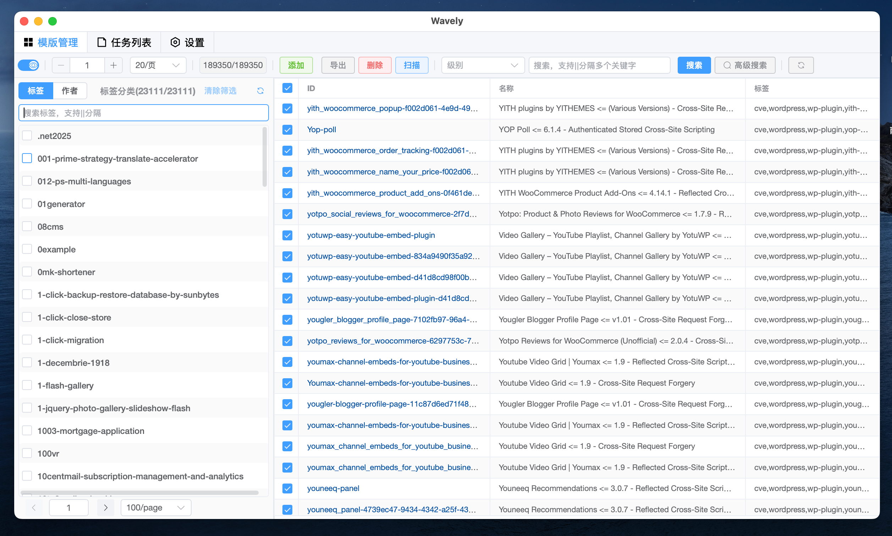
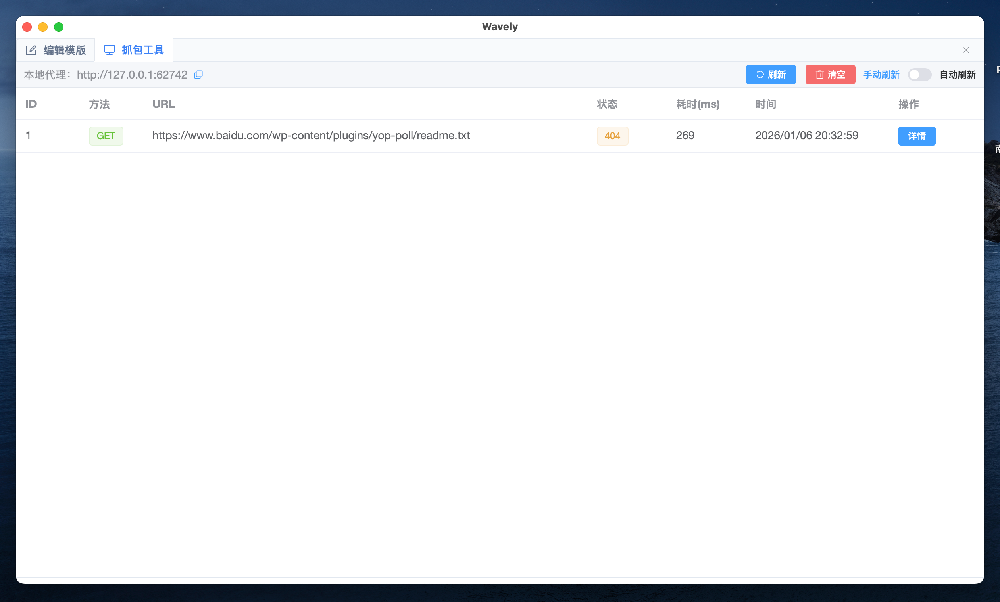
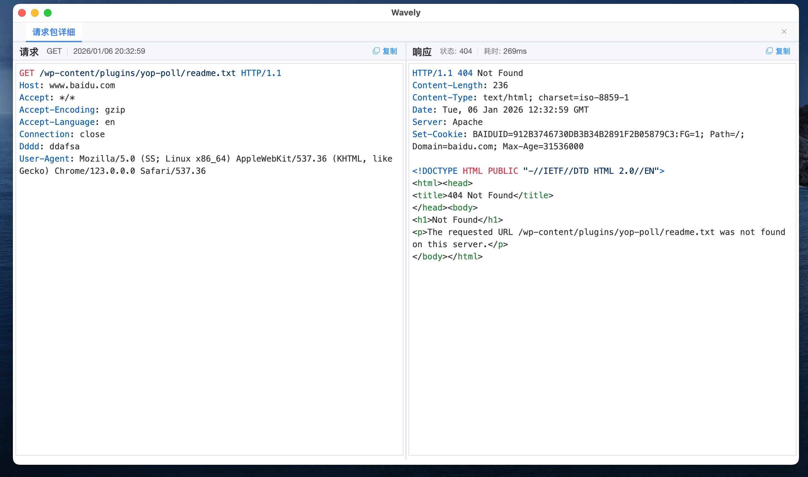
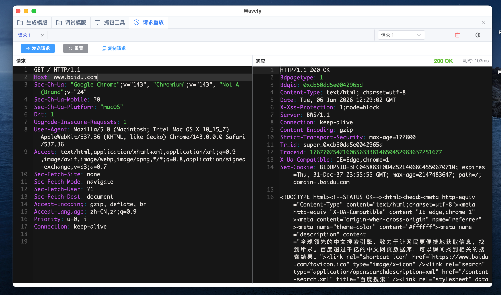

# Wavely — Nuclei POC 管理与漏洞验证工具
🔍 面向安全研究人员的本地化 POC 管理与漏洞验证平台。支持自定义模板、批量扫描、抓包调试、全局请求头等能力，帮助你更高效地验证与复现漏洞。





 
- 详细安装与激活请参阅：[Wavely 官方 Wiki](https://github.com/perlh/Wavely/wiki)

## ✨ 功能一览
- [x] POC 模板管理：增删查改、导入去重（基于 Template ID）
- [x] 多任务扫描：支持多 POC、多目标批量运行，可手动停止任务
- [x] 请求分析与调试：完整请求/响应查看、内置抓包、HTTP 请求重放
- [x] 编辑器体验：主题切换、字体大小调整、YAML 语法检查、Raw 自动解析
- [x] 高级配置：自定义 DNSLog、扫描速率控制、HTTP/HTTPS/SOCKS5 代理、请求超时
- [x] 搜索与过滤：关键词组合搜索、基于 tag/author 的分组过滤、高级搜索与重载
- [x] 导入与导出：拖拽 YAML/POC 文件夹快速导入、批量导出 POC、导出扫描统计报告（xlsx、docx）
- [x] 配置持久化：自动保存用户配置，下次启动无需重复设置
- [x] API 测试：支持对接口及带目录路径的目标进行扫描
- [x] 扫描进度与结果：可视化进度展示，支持结果导出
- [x] 跨平台兼容：macOS 与 Windows 已支持，Linux 版本测试中

近期更新
- v3.2.8：新增基于 author 分组过滤；POC 搜索支持多关键字；支持 HTTP 请求重放
- v3.2.7：新增 DSL/Binary/Size 匹配与多种 extractors（regex/json/kval）；新增基于 tag 标签分组过滤；新增请求超时配置参数


## 1、📦  安装指南
💡 提示：关于安装与使用的常见问题，请参阅文末的[常见问题](#常见问题)部分。

###  MacOS（安装 / 更新）

- 将 Wavely.app 拖入 Applications 文件夹
- 打开终端执行以下命令以移除系统隔离属性：

```bash
sudo xattr -d com.apple.quarantine /Applications/Wavely.app
```

###  💻 Windows （安装 / 更新）

- 下载最新压缩包并解压
- 运行 Wavely-windows-installer.exe 完成安装


## 2、 使用说明

### 🔐  激活注册
- 请参考官方激活说明：
🔗 [Wavely 激活指南：https://github.com/perlh/Wavely/wiki](https://github.com/perlh/Wavely/wiki)

激活码仅可成功激活一次，激活后会在 ~/.wavely/license 生成许可证文件

|平台 |路径|
|-|-|
|macOS / Linux| ~/.wavely/license |
|Windows| 与 Wavely.exe 同级目录下|

但请注意：
> - 软件升级时，请下载最新安装包覆盖安装即可，切勿卸载后再安装，以免license丢失
> - 补充说明：v3.2.6 及以上版本可随意安装，无此限制。


#### 📍 License 文件位置


### 🌐 DNSLog 配置说明
- 默认使用 Nuclei 官方 Interactsh 服务（无需额外配置）
- 如需使用私有 DNSLog，请参考官方搭建指南：
👉 [Interactsh 搭建文档](https://github.com/projectdiscovery/interactsh)


> ❗ 重要：该文件是您唯一的本地授权凭证，一旦丢失将无法自动恢复。如不慎遗失，请通过邮箱联系开发者。

## 🚀 基本使用


### ➕ 2.2 导入 POC（v3.2.4+）
- 将包含 POC 的文件夹直接拖拽至主窗口，即可批量导入


### ✏️ 2.3 添加 POC

### ✏️ 2.4 编辑 POC


### 🕵️ 2.5 抓包工具
- 编辑模板


- 抓包管理



- 抓包详情



### 🔁 请求包重放


### 🌐 2.6 全局请求头
- 配置界面


- 详细设置


## ❓ 常见问题
### ❓ Windows 启动时短暂出现命令框？
✅ 属于正常现象，不影响功能，可放心使用

### ❓ macOS 无法打开 App？
由于未使用 Apple 官方证书签名，可能出现以下提示：
- “已损坏，无法打开”
- “无法验证开发者身份”
- App 图标显示禁止符号

##### ✅ 解决方案

方案一（推荐）：移除隔离属性
```bash
sudo xattr -d com.apple.quarantine /Applications/Wavely.app
```
方案二：修复执行权限
```bash
chmod 755 /Applications/Wavely.app/Contents/MacOS/Wavely
```
## ⚠️ 免责声明
本工具仅用于合法授权的企业安全建设场景。如需测试本工具的可用性，请自行搭建靶机环境。
- 为避免被恶意使用，本项目收录的 POC 均为漏洞的理论判断，不包含漏洞利用过程，不会对目标发起真实攻击或利用
- 在使用本工具进行检测时，需确保行为符合当地法律法规，并已经取得充分授权
- 请勿对非授权目标进行扫描。如在使用过程中存在任何非法行为，相关后果由使用者自行承担，项目不承担任何法律或连带责任


## 📈 Star History

[](https://star-history.com/#perlh/wavely&Date)

## ❤️ 支持我们
如果 Wavely 对你的工作有所帮助，欢迎通过赞赏支持开发
微信赞赏码
<div align="center">

</div>
你的支持是我们持续维护和迭代的动力，感谢每一位用户 🙏

📌 项目地址：[github.com/perlh/Wavely](https://github.com/perlh/Wavely)
📩 反馈与激活问题：id_0909186@foxmail.com
